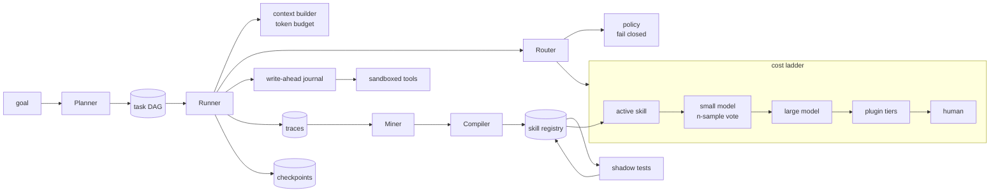

# crystallizer-ai

An agent harness that gets cheaper the longer it runs. It keeps context small, survives crashes,
and compiles repeated mechanical agent behavior into declarative, tested skills, routing every
step down the cheapest safe path. Any agent system (a model, an external agent framework, a rules
engine, a human) can be plugged in as a rung of that path and inherits the same safety envelope.

## How it works, in five lines

1. A goal is planned into a DAG of tasks, each with planned steps and acceptance commands.
2. Every step walks a cost ladder: **active skill → small model → large model → human**.
3. Actions run through a write-ahead journal inside a sandbox; tasks count as done only when their
   acceptance commands pass; everything is traced and checkpointed.
4. Verified steps that repeat with constant or situation-derived arguments are mined into
   declarative JSON skills, shadow-tested against later verified work, and promoted on evidence.
5. Promoted skills answer those steps for free; a skill that starts failing is demoted.

## Quickstart (MockModel only, no API key)

Requires Python 3.11+ and git.

    git clone https://github.com/MrKazino/crystallizer-ai.git
    cd crystallizer-ai
    make install
    . .venv/bin/activate

Watch the cost drop as skills crystallize (five runs of the add-modules scenario):

    crystallizer bench --scenario add-modules --runs 5 --profile e2e

Runs 1 to 3 route every step to the models; skills are mined after run 1, shadow-tested in runs 2
and 3, and promoted; runs 4 and 5 answer all 16 mechanical steps from skills, so their cost falls
to about 23% of run 1. Then drive a tiny project yourself:

    cp -r examples/quickstart /tmp/crystallizer-quickstart
    crystallizer --workspace /tmp/crystallizer-quickstart plan "Write two greeting files"
    crystallizer --workspace /tmp/crystallizer-quickstart run --dry-run
    crystallizer --workspace /tmp/crystallizer-quickstart run
    crystallizer --workspace /tmp/crystallizer-quickstart status
    crystallizer --workspace /tmp/crystallizer-quickstart report

In the quickstart script the small model disagrees on one step, so you will see it escalate to
the large model. Every command accepts `--json`.

## Architecture

Details: [docs/ARCHITECTURE.md](docs/ARCHITECTURE.md). Contract: [docs/SPEC.md](docs/SPEC.md)
(v2.0). Plugging in other agent systems, model providers, tools and observers:
[docs/EXTENDING.md](docs/EXTENDING.md).

## Commands

| Command | Purpose |
|---|---|
| `init` | write `crystallizer.toml` and create the state directory |
| `plan GOAL` | plan a goal into a task DAG |
| `run` / `resume` | run unfinished tasks / continue an interrupted run without repeating side effects |
| `status` | plan, run cursor, task states, skill counts |
| `report` | cost by route and the estimated saving against an all-large baseline |
| `skills list\|show\|promote\|demote\|mine\|evaluate\|export\|import` | manage skills |
| `tools list` | tool descriptors with JSON Schema arguments |
| `bench --scenario NAME --runs N` | reproducible MockModel benchmark (JSON) |
| `schemas export\|check` | regenerate or verify the committed JSON Schemas |

Global flags (before or after the command): `--config`, `--profile`, `--workspace`, `--verbose`,
`--debug`, `--dry-run` (no tools, no state, no model calls), `--json`.

## Exit codes

| Code | Meaning |
|---|---|
| 0 | success |
| 1 | general error |
| 2 | usage or configuration error |
| 3 | a task failed (or was blocked by a failed dependency) |
| 4 | human approval unavailable (no TTY) or denied |
| 5 | workspace locked by another run |
| 6 | no valid checkpoint could be restored |
| 7 | budget exhausted (raise the limit and `resume`) |

## Honest limits

1. Only mechanical steps can become skills: steps whose every argument is a constant or a value
   derivable from the situation. Steps needing model-authored content always go to a model.
2. The benchmark uses MockModel. It proves the routing, mining, shadow-testing, and promotion
   mechanics work. It does not prove cost savings with a real model.
3. The tool sandbox confines paths, executables, environment, and time. It is not OS-level
   isolation. Recommend running inside a container for untrusted work.
4. Cost defaults are illustrative units. Users must set real prices in config.

More limits, decisions and risks: [NOTES.md](NOTES.md).

## Development

    make install     # virtualenv with pinned dev dependencies
    make check       # ruff, mypy --strict, pytest (>= 90% coverage), schema drift check

See [CONTRIBUTING.md](CONTRIBUTING.md) and [docs/ROADMAP.md](docs/ROADMAP.md).

## License

Proprietary: the source is visible for viewing only, and no use is permitted without written
permission from the copyright holder (see [LICENSE](LICENSE)).
