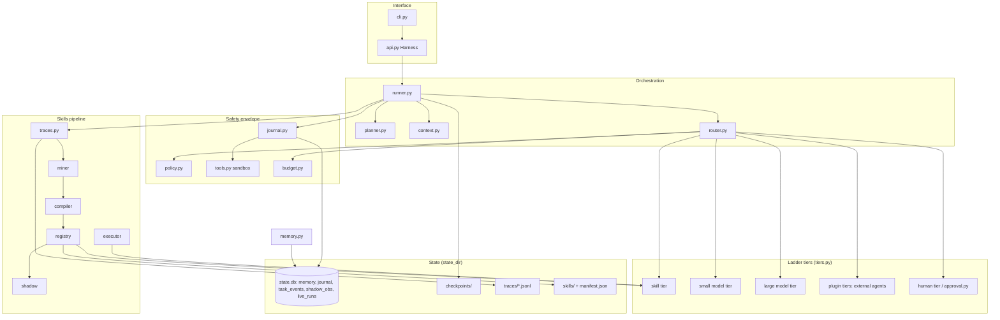
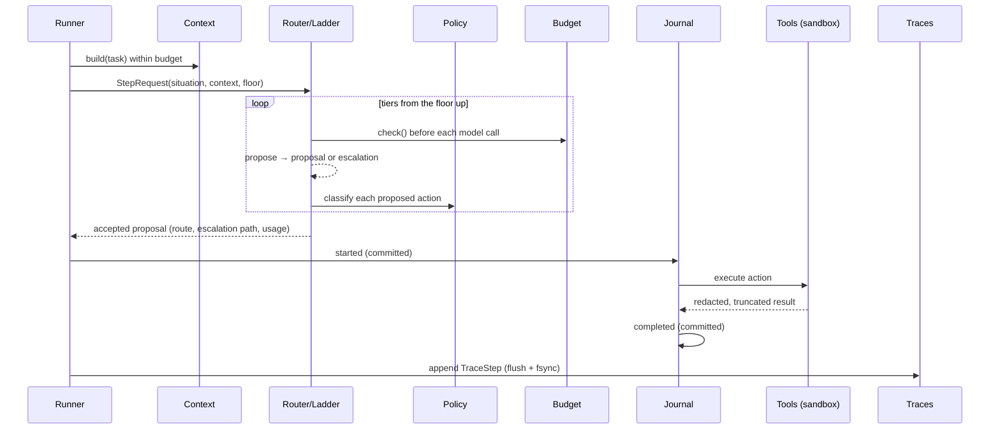
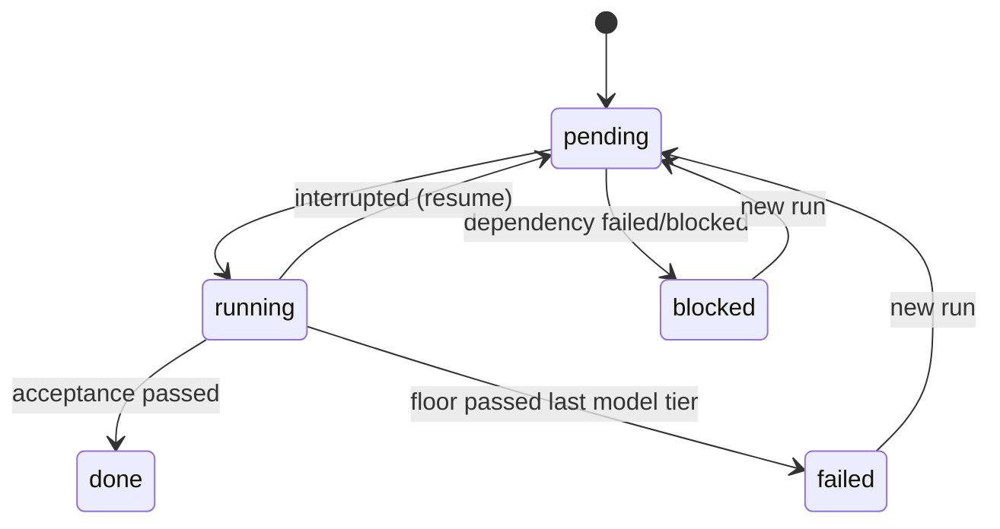
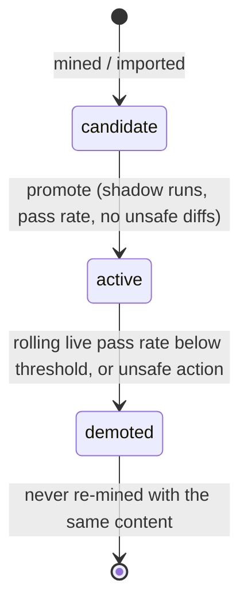
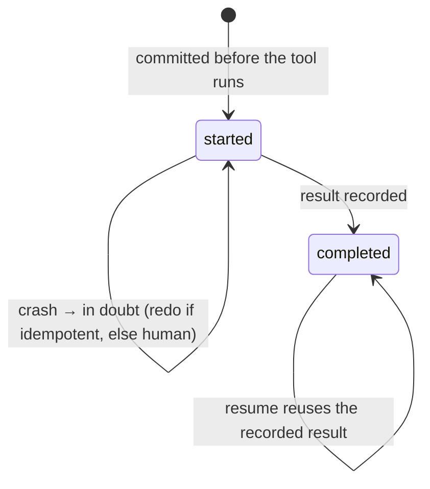

# Architecture

This document explains how crystallizer works: the layers, the life of one step, the state
machines, where state lives, and where the trust boundaries are. The normative contract is
[SPEC.md](SPEC.md); this is the explanation.

## 1. The idea in one paragraph

An agent spends most of its budget re-deriving the same mechanical steps: scaffold a file from a
template, stage it, commit it, rerun the tests. crystallizer records every verified step, finds
sequences that repeat across tasks with arguments that are either constant or derivable from the
task's parameters, compiles them into declarative skills (JSON, never code), proves them in the
shadows against later verified work, and only then lets them answer instead of a model. Every step
walks a cost ladder from the cheapest tier that can answer safely to the most expensive, so the
longer the harness runs, the more steps cost nothing.

## 2. Layers

Cross-cutting: `redaction.py` (every string that leaves the process or is persisted),
`events.py` (observers), `extensions.py` (plugins), `clock.py` and `hashing.py` (determinism),
`errors.py` (exit codes).

## 3. Life of one step

After the last step: acceptance commands (through the same sandbox and policy), a verdict record,
a memory entry, shadow observations for candidates, live-run accounting for skills used, and a
checkpoint.

## 4. The ladder and its gates

| Gate | Rule |
|---|---|
| Floor | Attempt `k` of a task starts at a floor tier; acceptance failures raise it after `retries`. |
| Skill applicability | Remaining planned step kinds match the skill's, and the guard holds. |
| Agreement | Model tiers vote over samples; accept only at agreement ≥ threshold. |
| Confidence | Agreement, capped at 0.5 with a single sample. |
| Irreversible | Not allow-listed → human. Allow-listed → confidence ≥ `irreversible_confidence`. Skills never emit irreversible actions (immediate demotion). |
| Budget | Checked before every model call; exhaustion checkpoints and exits 7. |
| Human | TTY required; otherwise exit 4. |

## 5. State machines

### Task

### Skill

### Journal entry

## 6. Where state lives

    state_dir/                  (default .crystallizer/, never reachable by tools)
      run.lock                  PID of the running process
      state.db                  SQLite WAL: memory, journal, task_events, shadow_obs, live_runs
      checkpoints/ckpt-*.json   last 3 verified checkpoints
      traces/<run_id>.jsonl     append-only step and verdict records
      skills/candidates/        skill JSON files awaiting promotion
      skills/active/            promoted skills (only registry.promote writes here)
      skills/demoted/           retired skills
      skills/manifest.json      registry index with history and evidence

## 7. Trust boundaries

| Source | Trusted? | Handling |
|---|---|---|
| Model output (plans, actions, acceptance commands) | No | validated by pydantic, classified by policy, executed only in the sandbox |
| Tool output | No | redacted, truncated, never executed, never treated as instructions |
| Skills on disk | Data only | parsed and validated by the executor; no eval, exec or import |
| Imported skills | No | enter as candidates; must pass local shadow testing |
| Plugins | Yes, by explicit opt-in | loaded only when named; cannot override built-ins; their tools default to irreversible |
| Observers | Read-only | receive redacted, frozen events; exceptions isolated |

## 8. Determinism

All time comes from an injected `Clock`, all randomness from a seeded `random.Random`, all hashing
from canonical JSON. Hypothesis runs derandomized. Given the same seed and scenario, the benchmark
produces the same JSON.
